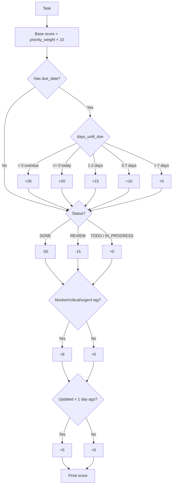

# Algorithm Deconstruction Challenge — Task Priority Sorting Algorithm

## Algorithm selected & why
Of the three options, I picked **Algorithm 1: Task Priority Sorting** because it directly follows up on something the previous journal flagged: in the current codebase, `TaskPriority` is *purely informational* — it doesn't drive sort order or overdue logic anywhere. This algorithm is exactly the missing piece that would make priority actually functional, so deconstructing it builds straight on that earlier finding.

---

## Breaking down `calculate_task_score(task)`

The function builds a single numeric "importance score" out of four independent adjustments, applied in this order:

| Step | Factor | Effect |
|---|---|---|
| 1 | **Base priority weight** | `LOW=1, MEDIUM=2, HIGH=4, URGENT=6`, each ×10 → base scores of 10/20/40/60 |
| 2 | **Due-date proximity** | Overdue: **+35**; due today: **+20**; due in 1–2 days: **+15**; due in 3–7 days: **+10**; due further out: **+0** |
| 3 | **Status adjustment** | `DONE`: **−50**; `REVIEW`: **−15**; `TODO`/`IN_PROGRESS`: **+0** |
| 4 | **Tag boost** | **+8** if any tag is `blocker`, `critical`, or `urgent` |
| 5 | **Recency boost** | **+5** if updated less than 1 day ago |

Notice the priority *weights* (1/2/4/6) aren't linear — the jump from HIGH to URGENT (4→6) is smaller than LOW to MEDIUM to HIGH (1→2→4), so urgency past "high" matters less to the score than the early jumps do.

### Visual: scoring decision flow

### `sort_tasks_by_importance` and `get_top_priority_tasks`
- `sort_tasks_by_importance` computes `(score, task)` for every task, then calls `sorted(..., reverse=True)` on that list of tuples.
- `get_top_priority_tasks` just runs the above and slices the first `limit` results.

---

## Worked examples (traced by hand)

**Task A** — priority `HIGH`, due yesterday, status `TODO`, tags `["blocker"]`, updated today:
`40 (HIGH base) + 35 (overdue) + 0 (TODO) + 8 (blocker tag) + 5 (recent) = 88`

**Task B** — priority `LOW`, due in 5 days, status `IN_PROGRESS`, no tags, updated 3 days ago:
`10 (LOW base) + 10 (due in 3–7 days) + 0 + 0 + 0 = 20`

**Task C** — priority `URGENT`, overdue, status `DONE`:
`60 (URGENT base) + 35 (overdue) − 50 (DONE) = 45`

Task C is the interesting one: **a completed, overdue task still picks up the full +35 overdue bonus** before the DONE penalty is applied, because the due-date check never looks at `task.status`. It nets out lower than Task A, but it's still ahead of some active, lower-priority tasks — a completed task shouldn't really be competing for "top priority" attention at all.

---

## Insights and learning points

- **Design pattern**: this is a classic *weighted scoring function* — each factor is scored independently and summed, which makes it easy to add a new factor later (e.g., an "assignee workload" adjustment) without touching the others.
- **Separation of concerns**: scoring (`calculate_task_score`), ordering (`sort_tasks_by_importance`), and limiting (`get_top_priority_tasks`) are three small, single-purpose functions layered on top of each other — easy to test each in isolation.
- **A real bug**: `sorted(task_scores, reverse=True)` sorts a list of `(score, task)` tuples. Python only compares the second tuple element (`task`) when two scores are **exactly equal** — and with integer scores built from a handful of fixed bonuses, ties are common. `Task` has no `__lt__`/`__gt__` defined, so on a tie this will raise a `TypeError` at runtime (`'<' not supported between instances of 'Task' and 'Task'`). This is a latent crash waiting for two tasks to land on the same score.
- **A design quirk**: the overdue bonus (+35) is calculated before the status penalty, so a `DONE`-but-overdue task still gets credit for being overdue, when arguably a finished task shouldn't be scored for urgency at all.

---

## Reflection Questions

**How did breaking it down change my understanding?**
On a first read this looked like a simple "add up some numbers" function. Tracing actual examples by hand is what surfaced that a *completed* task can still receive an overdue bonus, and that the priority weights aren't evenly spaced — neither was obvious just from skimming the code.

**What's still difficult after breaking it down?**
Whether the specific point values (35, 20, 15, 10, −50, −15, +8, +5) were chosen deliberately (e.g., "overdue should always outrank a today-due task by exactly 15 points") or just tuned by trial and error. Without a spec or comment explaining the weighting rationale, I can only reverse-engineer the *relative* ordering, not confirm intent.

**How would I explain this to another junior developer?**
"It's a five-factor point system: start with a base score from priority, add points the closer the due date is, subtract points if it's done or in review, add a small bonus for urgent-sounding tags, and a small bonus if it was touched recently. Higher total score = shows up first. But watch out — if two tasks land on the exact same score, sorting it will crash."

**Did I test this understanding against AI?**
Yes — walking through the three worked examples above (calculating each by hand, factor by factor) was effectively testing my own reading of the code against what the logic actually computes, and that's exactly what surfaced the tie-breaking bug and the DONE-but-overdue quirk rather than just accepting the code at face value.

**How might I improve the algorithm?**
- Sort using a key function that only ever compares the numeric score (e.g., sort by `-score` directly, or use a `key=` parameter that extracts just the score) so a tie never forces a comparison between two `Task` objects.
- Skip the due-date bonus entirely when `status == DONE`, since a finished task's due date is no longer actionable.
- Document the specific point values somewhere (a comment or constant names like `OVERDUE_BONUS = 35`) so future readers know these are the tunable knobs, not just magic numbers.
